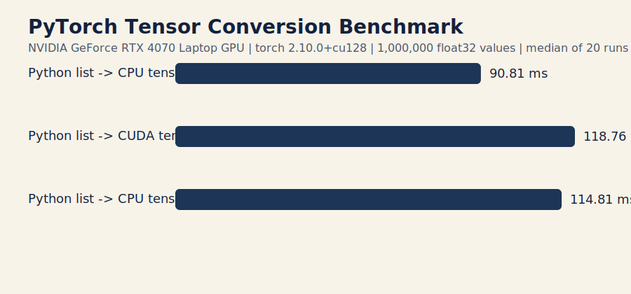

# Enterprise Commodities GraphRAG

This repository starts with the ontology and graph bootstrap assets for a commodities intelligence system.

The first implementation target is Neo4j because it gives the fastest path to:

- causal graph traversal
- source-aware market intelligence
- GraphRAG retrieval over structured entities and relationships

## Contents

- `ontology/commodity_ontology.md`: ontology specification
- `ontology/model/phase1.yaml`: editable ontology instance data
- `ontology/neo4j/schema.cypher`: constraints and indexes
- `ontology/neo4j/seed.cypher`: generated base demo graph
- `scripts/`: graph generation, extraction, and benchmarking entry points
- `src/data_loader.py`: local and Hugging Face dataset loading helpers
- `src/accelerator.py`: CUDA/MPS/CPU device detection helpers

## Initial scope

Phase 1 focuses on a macro-linked commodity graph:

- commodities: gold, silver, Brent crude, copper
- indicators: US real yields, Fed funds, CPI, DXY, China property activity
- institutions: Federal Reserve, OPEC, IEA
- countries: United States, China, Saudi Arabia, Chile, Egypt
- industries: solar, EV batteries, construction
- event mechanisms: rate sensitivity, inflation hedge demand, dollar pressure, supply shock, logistics constraint
- observations: prices, inflation, yields, policy rate, freight stress, China activity

## Usage

Generate the seed data from YAML, then load the schema and seed data.

```powershell
.\venv\Scripts\python.exe scripts\generate_neo4j_seed.py
```

```cypher
:source ontology/neo4j/schema.cypher
:source ontology/neo4j/seed.cypher
```

The seed data is intentionally small and explainable. It is meant to validate ontology shape and causal reasoning before ingesting larger document corpora and time series.

## Claim Extraction Pipeline

A minimal rule-based extraction pipeline is included for curated narrative text.

```powershell
.\venv\Scripts\python.exe scripts\extract_graph_claims.py
.\venv\Scripts\python.exe scripts\generate_neo4j_seed.py --input ontology/model/phase1_enriched.yaml --output ontology/neo4j/seed_enriched.cypher
```

Inputs and outputs:

- `corpus/curated_docs.yaml`: curated narrative documents
- `ontology/model/extracted_claims.yaml`: generated `Document` and `Claim` nodes plus `SUPPORTS` and `ABOUT` edges
- `ontology/model/phase1_enriched.yaml`: merged graph dataset ready for Neo4j seed generation

The extractor is intentionally simple and deterministic. It is a starter ingestion path for relationship-bearing text, not a substitute for a full LLM extraction pipeline.

## Hardware Specs

This repository was benchmarked on the following local machine:

- Laptop: HP OMEN Transcend 16
- OS: Windows 11 (`10.0.26200`)
- CPU: Intel Core i7-13700HX, 16 cores / 24 logical processors
- RAM: 34.0 GB installed
- GPU: NVIDIA GeForce RTX 4070 Laptop GPU
- PyTorch: `2.10.0+cu128`
- CUDA runtime detected by PyTorch: `12.8`

## Dataset Description

The repository currently ships with a hand-authored ontology dataset in `ontology/model/phase1.yaml` and a curated explanatory corpus in `corpus/curated_docs.yaml`.

For external expansion, `src/data_loader.py` is set up around the Hugging Face dataset `aaronmat1905/global-commodity-shocks-analysis-data`, which is a commodity shock analysis dataset suitable for enriching event and macro-linked commodity reasoning:

- Dataset page: `https://huggingface.co/datasets/aaronmat1905/global-commodity-shocks-analysis-data`

The current repo does not automatically ingest that dataset into the graph yet. It is documented as the first Hugging Face dataset target for structured expansion beyond the curated starter corpus.

## Benchmark Results

PyTorch tensor conversion was benchmarked with `scripts/benchmark_tensor_conversion.py` using `1,000,000` float32 values and the median of `20` runs.

Results from this machine:

- Python list -> CPU tensor: `90.81 ms`
- Python list -> CUDA tensor: `118.76 ms`
- Python list -> CPU tensor -> CUDA: `114.81 ms`

Benchmark artifacts:

- `docs/assets/tensor_conversion_benchmark.json`
- `docs/assets/tensor_conversion_benchmark.svg`


